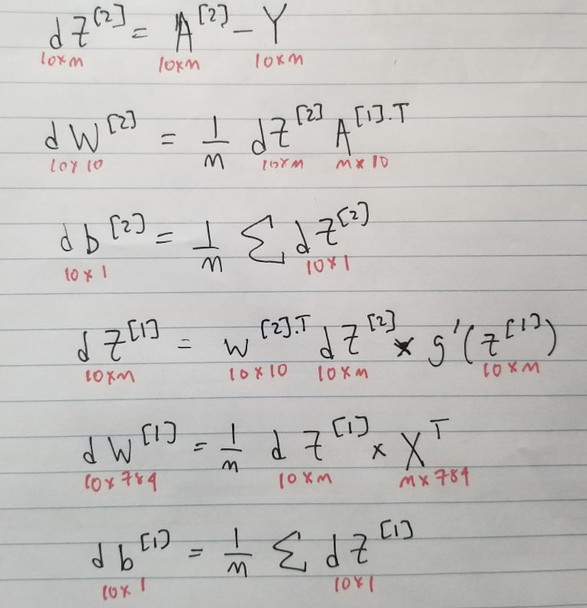

# Digit Interpreter

 

  

## Introduction
Three layered Neural Network to interpret the numerical value of digits from its visual representations. 

This is introductory project to ML & Neural Network Architecture. 

Made using numpy and math. 

## Neural Network Architecture

  

**Dataset:** Built using the MNIST handwritten digit database, consisting of **_'m'_ training images**, with each image spanning 28 x 28 pixels. 

**Input Layer (_l_=[0]):** Input Layer has 784 nodes, each representing one pixel in an image of 28 by 28 pixels. 

**Output Layer (_l_=[2]):** Output Layer has 10 nodes, each representing a possible numerical prediction ranging from 0 to 9. 

### Forward Propogation: 

  

**Description:** 

**Z[i]** : Z(X) is a set of functions for each unit to predict the output given the set of inputs _'X'_. Each function is a linear combination of the scalar product of the weight **_'w [i]'_**,  a descriptor of the relative significance of the input and the previous, **_'A [i]'_** plus a constant bias term, **_'b [i]'_**, controlling the affect of the activation function on each node. 

**A[0]** : input layer with the set of inputs, **_'X'_**. 

**A[1]** : [ReLU](https://www.kaggle.com/dansbecker/rectified-linear-units-relu-in-deep-learning) activation function for Z[1]. This function returns 0 for any negative value of x and returns the value x for any positive value. 

**A[2]** : [Softmax](https://towardsdatascience.com/softmax-activation-function-how-it-actually-works-d292d335bd78) activation function for Z[1] which provides a multinomial probability distribution for each of the possible numerical outputs from 0 through 9. 

### Backward Propogation: 

  

**Description:** 

**dZ[i]** : Calculating error in each layer

**dW[i] & db[i]** : Calculating the contribution of weights and biases to error in each layer. 

### Updating Parameters: 

  

Updating individual parameters with a user-defined learning rate, &alpha; for gradient descent

